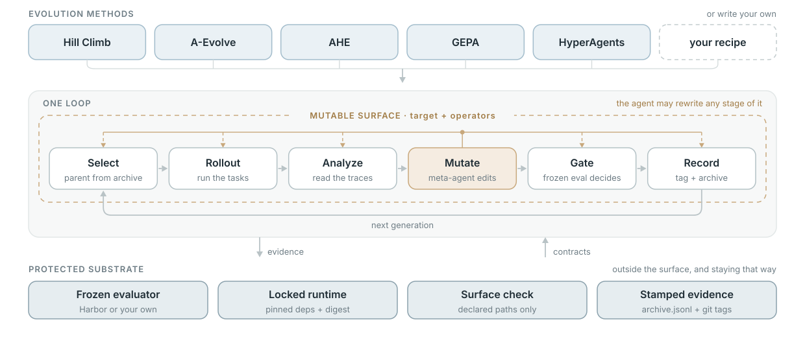

<h1 align="center">EvolveX</h1>

<p align="center">
  <strong>Traceable, evaluator-driven evolution for AI agents.</strong>
</p>

<p align="center">
  <a href="https://github.com/simple-agent-lab/simple-evolve-agent/actions/workflows/test.yml">
    
  </a>
  <a href="https://www.python.org/">
    
  </a>
  <a href="LICENSE">
    
  </a>
</p>

<p align="center">
  <a href="#overview">Overview</a> ·
  <a href="#features">Features</a> ·
  <a href="#quick-start">Quick Start</a> ·
  <a href="#concepts">Concepts</a> ·
  <a href="#recipes">Recipes</a> ·
  <a href="#result">Result</a> ·
  <a href="#documentation">Documentation</a>
</p>

## Overview

EvolveX is a file-based framework for running agent-evolution experiments without
rebuilding the mechanics for candidate snapshots, evaluation, lineage, and
reporting. It provides composable recipes inspired by systems such as A-Evolve,
AHE, GEPA, and HyperAgents.

Each experiment is a separate Git repository. Generation tags identify
candidates, `archive.jsonl` records outcomes, and the evaluator stays outside the
candidate's mutable surface. The project is an active prototype intended for
research and controlled experimentation.

## Features

- **Composable loops:** select, rollout, trace analysis, editing, validation,
  gating, and recording are independent operators.
- **Reproducible workspaces:** generated projects include a locked Python runtime,
  frozen evaluator configuration, and vendored framework mechanism.
- **Controlled self-modification:** each recipe declares exactly which target and
  operator paths may evolve.
- **Traceable outcomes:** Git lineage, evaluation artifacts, and stamped archive
  records connect every candidate to its evidence.
- **Content-bound evaluation:** Local task trees, generation commits, candidate
  runtimes, and replayed artifact bytes are bound into the evidence used for
  parent selection.

## Structure

<p align="center">
  
</p>

Every recipe runs the same loop: select a parent, run the tasks, analyze the
traces, edit, gate, record. Each stage is an operator rather than a fixed step,
and a recipe decides which of them the meta-agent may rewrite along with the
target. The evaluator, runtime, surface check, and evidence stamps stay outside
that surface.

## Repository layout

| Path | Role |
| --- | --- |
| `src/evolve/` | Framework implementation and CLI. |
| `library/` | Composable evolution operators. |
| `recipes/` | Runnable evolution configurations and method guides. |
| `skills/` | Skill packages used by agents and workspaces. |
| `evals/skills/` | Behavior and routing evaluations for those skills. |
| `tests/` | Deterministic implementation and contract tests. |
| `scaffolds/evaluators/` | Evaluator templates for generated workspaces. |
| `runs/` | Local generated artifacts; ignored and not source documentation. |

The current evaluation assets are documented in [`evals/README.md`](evals/README.md).

## Quick Start

Requirements: Python 3.12+, [`uv`](https://docs.astral.sh/uv/), and Git.

```bash
git clone https://github.com/simple-agent-lab/simple-evolve-agent.git
cd simple-evolve-agent
uv sync --dev --locked
uv run --frozen evolve --help
```

`evolve init` accepts an optional workspace path. When omitted, it creates the
workspace at `~/.evolve-workspace`; pass an explicit path for named or parallel
experiments.

Run a deterministic baseline smoke test without a model or Docker:

```bash
export EVOLVE_RUNTIME_DIGEST="sha256:local-smoke-runtime"
export EVOLVE_HOME="/tmp/evolve-home"

uv run evolve init /tmp/evolve-demo  # default recipe gepa: built-in seed, no clone
EVAL_STUB=1 /tmp/evolve-demo/evolve run /tmp/evolve-demo --max-generations 0
/tmp/evolve-demo/evolve status /tmp/evolve-demo
/tmp/evolve-demo/evolve verify /tmp/evolve-demo
```

This checks workspace generation, baseline evaluation, and archive integrity; it
does not run a mutation round or measure agent quality.

An outer coding agent can also orchestrate a generation while reusing the
framework's operators:

```bash
/tmp/evolve-demo/evolve operator list /tmp/evolve-demo
/tmp/evolve-demo/evolve operator run /tmp/evolve-demo select --genid 1
```

The agent reads the retained operator artifacts, forks and edits the selected
parent, then uses `commit`, `eval`, and `finalize`. This keeps the agent in
control of the harness change while the mechanism still owns evaluation,
configured admission checks, gating, recording, and lineage. Validation and
novelty results are tied to the exact candidate tree, so editing afterward
requires rerunning them. See the generated workspace's `program.md` and
`skills/evolve-agent/SKILL.md` for the complete sequence and method guidance.

For a real Harbor run, provide an immutable evaluator digest and a local task
dataset:

```bash
export EVOLVE_RUNTIME_DIGEST="sha256:replace-with-your-evaluator-digest"

uv run evolve preflight /tmp/evolve-harbor \
  --recipe aevolve \
  --dataset /absolute/path/to/harbor/tasks
uv run evolve init /tmp/evolve-harbor \
  --recipe aevolve \
  --dataset /absolute/path/to/harbor/tasks
evolve doctor /tmp/evolve-harbor --profile experiment
evolve smoke /tmp/evolve-harbor --profile experiment
/tmp/evolve-harbor/evolve run /tmp/evolve-harbor --max-generations 5
```

`evolve preflight` takes the same arguments as `init`, writes nothing, and
reports every unmet precondition as one checklist. Inspect a run with
`evolve status`, `evolve report`, `git tag --list 'gen/*'`,
and the generated `archive.jsonl`. Run `evolve --help` for the complete CLI.

## Concepts

| Concept | Meaning |
| --- | --- |
| workspace | A generated experiment repository. |
| target | The code or agent being improved. |
| operator | One step in the evolution loop. |
| evaluator | A pinned black-box scoring contract. |
| archive | Stamped outcomes in `archive.jsonl` plus generation tags. |
| mutable surface | The paths a proposal is allowed to change. |

The generated `.evolve/` runtime and evaluator are protected from candidate
edits. Operators run as subprocesses instead of being imported into the
framework process.

## Recipes

| Recipe | Search shape | Mutable surface |
| --- | --- | --- |
| `hill_climb` | single-parent improvement | target |
| `hill_climb_codex` | single-parent Codex prompt/skill improvement | target |
| `aevolve` | prompt and skill evolution | prompt and target skills |
| `ahe` | harness engineering | target |
| `ahe_codex` | Codex harness engineering | target |
| `gepa` (default) | Pareto selection with minibatch validation | prompt and task skill |
| `gepa_local` | GEPA with local no-Docker Harbor trials | knowledge file |
| `hyperagents` | target and meta-agent co-evolution | target and selected operators |
| `hyperagents_codex` | Codex and operator co-evolution | target and selected operators |

See [the recipe guide](recipes/README.md) for the workflow and configuration of
each recipe.

## Trust Boundaries

EvolveX enforces three core rules:

1. Scores and statuses are written by the mechanism, not workspace operators.
2. Canonical evaluation runs on clean candidate snapshots against a frozen
   evaluator.
3. Reports are recomputed from stamped archive records rather than mutable
   operator claims.

See [DESIGN.md](DESIGN.md) for the complete model and invariants.

## Result

> **TODO:** Add reproducible benchmark results and supporting artifacts once
> the evaluation setup and reporting protocol are finalized.

## Roadmap

- **Scenario-oriented recipes:** compose the current operator library into
  opinionated recipes for different agent-evolution use cases.
- **Local-first workflows:** make lightweight, Docker-free iteration a
  first-class path for trusted local agents, prompts, skills, and small features.
- **More method integrations:** add evolution and search methods while preserving
  the shared evaluator, lineage, and evidence contracts.

## Documentation

| Document | Purpose |
| --- | --- |
| [Design](DESIGN.md) | System model, ownership boundaries, and invariants. |
| [Architecture](ARCHITECTURE.md) | Enforced source-module map and line budgets. |
| [Recipes](recipes/README.md) | Supported evolution strategies. |
| [Evaluation assets](evals/README.md) | Skill behavior/routing evaluation cases and result snapshots. |
| [Meta-agents](META_AGENTS.md) | Trusted-host and isolated meta-agent runners. |
| [Trace analysis](TRACE_ANALYZER.md) | Trace retention and analyzer variants. |
| [Local environment](LOCAL_ENVIRONMENT.md) | Docker-free trusted local execution. |
| [Operations](docs/operations.md) | Doctor profiles, runtime setup, full-loop smoke, and recovery. |
| [Contributing](CONTRIBUTING.md) | Development setup and repository conventions. |
| [Releasing](RELEASING.md) | Source, artifact, and publication checklist. |

## License

EvolveX is licensed under [Apache-2.0](LICENSE). See
[NOTICE](NOTICE) for required attributions.
