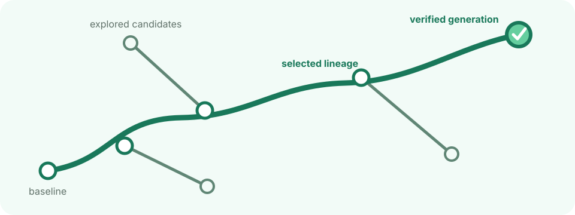

<p align="center">
  
</p>

<h1 align="center">Evolve Framework</h1>

<p align="center">
  <strong>Build agents that improve — and keep the evidence.</strong>
</p>

<p align="center">
  A file-based framework for evaluator-driven evolution, reproducible candidate
  lineage, and controlled self-modification.
</p>

<p align="center">
  <a href="https://github.com/simple-agent-lab/simple-evolve-agent/actions/workflows/test.yml">
    
  </a>
  <a href="https://www.python.org/">
    
  </a>
  <a href="LICENSE">
    
  </a>
</p>

<p align="center">
  <a href="#what-evolve-does">What Evolve Does</a> ·
  <a href="#how-evolve-works">How It Works</a> ·
  <a href="#what-can-evolve">What Can Evolve</a> ·
  <a href="#recipes">Recipes</a> ·
  <a href="#quick-start">Quick Start</a> ·
  <a href="#documentation">Documentation</a>
</p>

<p align="center">
  <a href="docs/evolve-lineage.svg">
    
  </a>
</p>

## What Evolve Does

Evolve gives an agent a controlled way to improve itself. It runs candidates
against a fixed evaluator, keeps the evidence for every generation, and carries
verified improvements forward without letting candidate code rewrite the rules
that score it.

| For agent builders | For researchers | Evidence built in |
| --- | --- | --- |
| Improve prompts, skills, harnesses, and agent code in a reusable experiment workspace. | Compare evolution strategies under fixed evaluation and mutation boundaries. | Connect every candidate to scores, artifacts, archive records, and Git lineage. |

## How Evolve Works

Every recipe composes the same loop:

**select → evaluate → analyze → mutate → gate → record**

<p align="center">
  <a href="docs/architecture.svg">
    
  </a>
</p>

A recipe decides how parents are selected, how traces are analyzed, what may be
edited, and which evaluations admit a new generation. The framework owns the
mechanism that makes those decisions inspectable: clean candidate snapshots,
protected scoring, surface enforcement, Git tags, and stamped archive records.

## What Can Evolve

| Surface | Examples | Best fit |
| --- | --- | --- |
| prompts and skills | system prompts, task skills, reusable instructions | policy and behavior improvement |
| harnesses and target code | tools, orchestration, agent implementation | agent engineering |
| selected evolution operators | analysis or mutation policy chosen by a recipe | controlled co-evolution |

Each recipe declares its mutable paths. Evaluators, archive stamps, and the
vendored framework mechanism stay outside that surface.

## Recipes

| Choose this when you want to… | Recipe | Mutable surface |
| --- | --- | --- |
| improve one candidate from its current best parent | `hill_climb` | target |
| evolve prompts and reusable agent skills | `aevolve` | prompt and target skills |
| engineer the agent harness against evaluator feedback | `ahe` | target |
| balance multiple objectives with minibatch validation | `gepa` | prompt and task skill |
| co-evolve the target and selected evolution policy | `hyperagents` | target and selected operators |

See [the recipe guide](recipes/README.md) for each strategy’s workflow and configuration.

## Quick Start

Requirements: Python 3.12+, [`uv`](https://docs.astral.sh/uv/), and Git.

```bash
git clone https://github.com/simple-agent-lab/simple-evolve-agent.git
cd simple-evolve-agent
uv sync --dev --frozen
uv run evolve --help
```

`evolve init` accepts an optional workspace path. When omitted, it creates the
workspace at `~/.evolve-workspace`; pass an explicit path for named or parallel
experiments.

Run a deterministic baseline smoke test without a model or Docker:

```bash
export EVOLVE_RUNTIME_DIGEST="sha256:local-smoke-runtime"
export EVOLVE_HOME="/tmp/evolve-home"

uv run evolve init /tmp/evolve-demo --recipe hill_climb
EVAL_STUB=1 /tmp/evolve-demo/evolve run /tmp/evolve-demo --max-generations 0
/tmp/evolve-demo/evolve status /tmp/evolve-demo
/tmp/evolve-demo/evolve verify /tmp/evolve-demo
```

This checks workspace generation, baseline evaluation, and archive integrity; it
does not run a mutation round or measure agent quality.

For a real Harbor run, provide an immutable evaluator digest and a local task
dataset:

```bash
export EVOLVE_RUNTIME_DIGEST="sha256:replace-with-your-evaluator-digest"

uv run evolve init /tmp/evolve-harbor \
  --recipe aevolve \
  --dataset /absolute/path/to/harbor/tasks
/tmp/evolve-harbor/evolve run /tmp/evolve-harbor --max-generations 5
```

`evolve preflight` takes the same arguments as `init`, writes nothing, and
reports every unmet precondition as one checklist. Inspect a run with
`evolve status`, `evolve report`, `git tag --list 'gen/*'`,
and the generated `archive.jsonl`. Run `evolve --help` for the complete CLI.

## Trustworthy by Construction

Evolve separates evolvable policy from the mechanism that judges it:

1. **The evaluator is frozen.** Candidates cannot change the scoring contract.
2. **Mutation is bounded.** Each recipe declares which target and operator paths may change.
3. **Evaluation is canonical.** New generations are scored from clean candidate snapshots.
4. **Evidence is durable.** Reports recompute results from stamped `archive.jsonl` records and Git generation tags.

Operators run as subprocesses rather than being imported into the framework
process. See [DESIGN.md](DESIGN.md) for the complete ownership model and invariants.

## Project Status

Evolve is an active prototype for research and controlled experimentation. The
current focus is reliable experiment mechanics, local-first workflows, and
composable strategies for different agent-evolution scenarios.

Benchmark results will be added only with a reproducible evaluation setup and
supporting artifacts.

## Roadmap

- **Scenario-oriented recipes:** compose the current operator library into
  opinionated recipes for different agent-evolution use cases.
- **Local-first workflows:** make lightweight, Docker-free iteration a
  first-class path for trusted local agents, prompts, skills, and small features.
- **More method integrations:** add evolution and search methods while preserving
  the shared evaluator, lineage, and evidence contracts.

## Documentation

| Document | Purpose |
| --- | --- |
| [Design](DESIGN.md) | System model, ownership boundaries, and invariants. |
| [Architecture](ARCHITECTURE.md) | Enforced source-module map and line budgets. |
| [Recipes](recipes/README.md) | Supported evolution strategies. |
| [Evaluation assets](evals/README.md) | Skill behavior/routing evaluation cases and result snapshots. |
| [Meta-agents](META_AGENTS.md) | Trusted-host and isolated meta-agent runners. |
| [Trace analysis](TRACE_ANALYZER.md) | Trace retention and analyzer variants. |
| [Local environment](LOCAL_ENVIRONMENT.md) | Docker-free trusted local execution. |
| [Operations](docs/operations.md) | Doctor profiles, runtime setup, full-loop smoke, and recovery. |
| [Contributing](CONTRIBUTING.md) | Development setup and repository conventions. |
| [Releasing](RELEASING.md) | Source, artifact, and publication checklist. |

## License

Evolve Framework is licensed under [Apache-2.0](LICENSE). See
[NOTICE](NOTICE) for required attributions.
