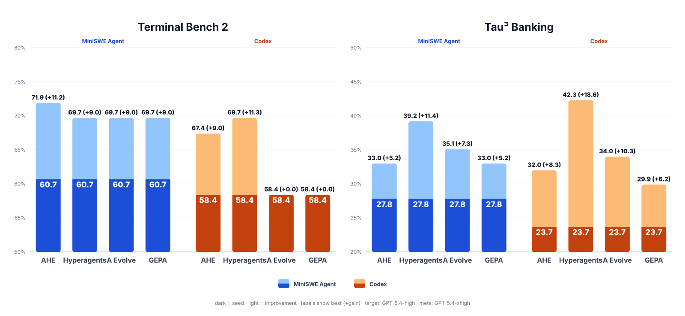
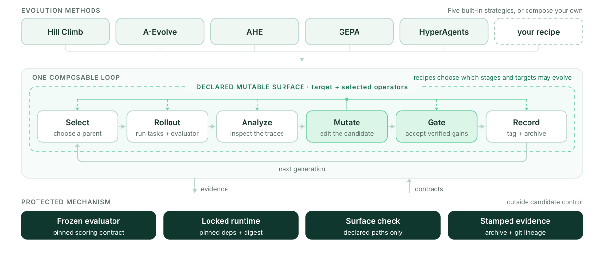

<p align="center">
  
</p>

<h1 align="center">EvolveX</h1>

<p align="center">
  <strong>Build agents that improve — and keep the evidence.</strong>
</p>

<p align="center">
  A file-based framework for evaluator-driven evolution, reproducible candidate
  lineage, and controlled self-modification.
</p>

<p align="center">
  <a href="https://github.com/simple-agent-lab/simple-evolve-agent/actions/workflows/test.yml">
    
  </a>
  <a href="https://www.python.org/">
    
  </a>
  <a href="LICENSE">
    
  </a>
  <a href="https://simple-agent-lab.github.io/simple-evolve-agent/">
    
  </a>
</p>

<p align="center">
  <a href="#what-evolvex-does">What EvolveX Does</a> ·
  <a href="#how-evolvex-works">How It Works</a> ·
  <a href="#what-can-evolve">What Can Evolve</a> ·
  <a href="#recipes">Recipes</a> ·
  <a href="#quick-start">Quick Start</a> ·
  <a href="#documentation">Documentation</a>
</p>

<p align="center">
  <a href="docs/evolve-lineage.svg">
    
  </a>
</p>

<p align="center">
  <a href="docs/assets/benchmark-results.svg">
    
  </a>
</p>

## What EvolveX Does

EvolveX gives an agent a controlled way to improve itself. It runs candidates
against a fixed evaluator, keeps the evidence for every generation, and carries
verified improvements forward without letting candidate code rewrite the rules
that score it.

| For agent builders | For researchers | Evidence built in |
| --- | --- | --- |
| Improve prompts, skills, harnesses, and agent code in a reusable experiment workspace. | Compare evolution strategies under fixed evaluation and mutation boundaries. | Connect every candidate to scores, artifacts, archive records, and Git lineage. |

## How EvolveX Works

Every recipe composes the same loop:

<p align="center">
  <strong>select → evaluate → analyze → mutate → gate → record</strong>
</p>

<p align="center">
  <a href="docs/assets/architecture.svg">
    
  </a>
</p>

A recipe decides how parents are selected, how traces are analyzed, what may be
edited, and which evaluations admit a new generation. The framework owns the
mechanism that makes those decisions inspectable: clean candidate snapshots,
protected scoring, surface enforcement, Git tags, and stamped archive records.

## What Can Evolve

| Surface | Examples | Best fit |
| --- | --- | --- |
| prompts and skills | system prompts, task skills, reusable instructions | policy and behavior improvement |
| harnesses and target code | tools, orchestration, agent implementation | agent engineering |
| selected evolution operators | analysis or mutation policy chosen by a recipe | controlled co-evolution |

Each recipe declares its mutable paths. Evaluators, archive stamps, and the
vendored framework mechanism stay outside that surface.

## Recipes

| Choose this when you want to… | Recipe | Mutable surface |
| --- | --- | --- |
| improve one candidate from its current best parent | `hill_climb` | target |
| evolve prompts and reusable agent skills | `aevolve` | prompt and target skills |
| engineer the agent harness against evaluator feedback | `ahe` | target |
| balance multiple objectives with minibatch validation | `gepa` | prompt and task skill |
| co-evolve the target and selected evolution policy | `hyperagents` | target and selected operators |

See [the recipe guide](recipes/README.md) for each strategy’s workflow and configuration.

## Quick Start

Run one of the supported recipes against the shared, content-pinned
Terminal-Bench 2.0 subset. The launcher requires Bash, Python 3.12+,
[`uv`](https://docs.astral.sh/uv/), Git 2.25+, and a running Docker daemon.

```bash
git clone https://github.com/simple-agent-lab/simple-evolve-agent.git
cd simple-evolve-agent

# API authentication is the default. Keep credentials out of recipe YAML.
cat > .env <<'EOF'
OPENAI_API_KEY=replace-me
# OPENAI_BASE_URL=https://your-openai-compatible-endpoint/v1
EOF

docker info
```

Choose a recipe, download and verify the pinned dataset, build that recipe's
pinned meta-agent image, and launch one generation:

```bash
RECIPE=ahe
./scripts/setup_terminal_bench.sh "$RECIPE"
./scripts/run_recipe_demo.sh "$RECIPE"
```

Supported values are `aevolve`, `ahe`, `ahe_codex`, `gepa`, `hill_climb`,
`hill_climb_codex`, `hyperagents`, and `hyperagents_codex`. Codex-capable
profiles may use `CODEX_AUTH_JSON_PATH=/absolute/path/to/auth.json` instead of
an API key. Use `WORKSPACE`, `TASKS`, `GENERATIONS`, `ENV_FILE`, or
`EVOLVE_ASSET_DIR` to override launcher defaults. See the
[recipe guide](recipes/README.md) and
[operations guide](docs/guides/operations.md) for the full configuration and
recovery workflow.

### Benchmark results

Scores are shown as **seed → best**, with the absolute change underneath. All
runs use a GPT-5.4-high target model and a GPT-5.4-xhigh Codex meta-agent.

#### Terminal Bench 2

Split: **50 train / 19 gate / 20 sealed**.

<table width="100%">
  <thead>
    <tr>
      <th width="14%">Target agent</th>
      <th width="14%">Method</th>
      <th width="18%">Train</th>
      <th width="18%">Gate</th>
      <th width="18%">Sealed</th>
      <th width="18%">Overall</th>
    </tr>
  </thead>
  <tbody>
    <tr>
      <td rowspan="4">MiniSWE Agent</td>
      <td>AHE</td>
      <td>58.0% → 74.0%<br><strong>(+16.0%)</strong></td>
      <td>57.9% → 68.4%<br><strong>(+10.5%)</strong></td>
      <td>70.0% → 70.0%<br><strong>(+0.0%)</strong></td>
      <td>60.7% → 71.9%<br><strong>(+11.2%)</strong></td>
    </tr>
    <tr>
      <td>Hyperagents</td>
      <td>58.0% → 68.0%<br><strong>(+10.0%)</strong></td>
      <td>57.9% → 73.7%<br><strong>(+15.8%)</strong></td>
      <td>70.0% → 70.0%<br><strong>(+0.0%)</strong></td>
      <td>60.7% → 69.7%<br><strong>(+9.0%)</strong></td>
    </tr>
    <tr>
      <td>A Evolve</td>
      <td>58.0% → 68.0%<br><strong>(+10.0%)</strong></td>
      <td>57.9% → 78.9%<br><strong>(+21.0%)</strong></td>
      <td>70.0% → 65.0%<br><strong>(−5.0%)</strong></td>
      <td>60.7% → 69.7%<br><strong>(+9.0%)</strong></td>
    </tr>
    <tr>
      <td>GEPA</td>
      <td>58.0% → 68.0%<br><strong>(+10.0%)</strong></td>
      <td>57.9% → 68.4%<br><strong>(+10.5%)</strong></td>
      <td>70.0% → 75.0%<br><strong>(+5.0%)</strong></td>
      <td>60.7% → 69.7%<br><strong>(+9.0%)</strong></td>
    </tr>
    <tr>
      <td rowspan="4">Codex</td>
      <td>AHE</td>
      <td>58.0% → 74.0%<br><strong>(+16.0%)</strong></td>
      <td>52.6% → 47.4%<br><strong>(−5.2%)</strong></td>
      <td>65.0% → 70.0%<br><strong>(+5.0%)</strong></td>
      <td>58.4% → 67.4%<br><strong>(+9.0%)</strong></td>
    </tr>
    <tr>
      <td>Hyperagents</td>
      <td>58.0% → 72.0%<br><strong>(+14.0%)</strong></td>
      <td>52.6% → 57.9%<br><strong>(+5.3%)</strong></td>
      <td>65.0% → 75.0%<br><strong>(+10.0%)</strong></td>
      <td>58.4% → 69.7%<br><strong>(+11.3%)</strong></td>
    </tr>
    <tr>
      <td>A Evolve</td>
      <td>58.0% → 58.0%<br><strong>(+0.0%)</strong></td>
      <td>52.6% → 52.6%<br><strong>(+0.0%)</strong></td>
      <td>65.0% → 65.0%<br><strong>(+0.0%)</strong></td>
      <td>58.4% → 58.4%<br><strong>(+0.0%)</strong></td>
    </tr>
    <tr>
      <td>GEPA</td>
      <td>58.0% → 58.0%<br><strong>(+0.0%)</strong></td>
      <td>52.6% → 52.6%<br><strong>(+0.0%)</strong></td>
      <td>65.0% → 65.0%<br><strong>(+0.0%)</strong></td>
      <td>58.4% → 58.4%<br><strong>(+0.0%)</strong></td>
    </tr>
  </tbody>
</table>

#### Tau³ Banking

Split: **50 train / 20 gate / 27 sealed**.

<table width="100%">
  <thead>
    <tr>
      <th width="14%">Target agent</th>
      <th width="14%">Method</th>
      <th width="18%">Train</th>
      <th width="18%">Gate</th>
      <th width="18%">Sealed</th>
      <th width="18%">Overall</th>
    </tr>
  </thead>
  <tbody>
    <tr>
      <td rowspan="4">MiniSWE Agent</td>
      <td>AHE</td>
      <td>30.0% → 36.0%<br><strong>(+6.0%)</strong></td>
      <td>35.0% → 35.0%<br><strong>(+0.0%)</strong></td>
      <td>18.5% → 25.9%<br><strong>(+7.4%)</strong></td>
      <td>27.8% → 33.0%<br><strong>(+5.2%)</strong></td>
    </tr>
    <tr>
      <td>Hyperagents</td>
      <td>30.0% → 38.0%<br><strong>(+8.0%)</strong></td>
      <td>35.0% → 45.0%<br><strong>(+10.0%)</strong></td>
      <td>18.5% → 37.0%<br><strong>(+18.5%)</strong></td>
      <td>27.8% → 39.2%<br><strong>(+11.4%)</strong></td>
    </tr>
    <tr>
      <td>A Evolve</td>
      <td>30.0% → 34.0%<br><strong>(+4.0%)</strong></td>
      <td>35.0% → 45.0%<br><strong>(+10.0%)</strong></td>
      <td>18.5% → 29.6%<br><strong>(+11.1%)</strong></td>
      <td>27.8% → 35.1%<br><strong>(+7.3%)</strong></td>
    </tr>
    <tr>
      <td>GEPA</td>
      <td>30.0% → 32.0%<br><strong>(+2.0%)</strong></td>
      <td>35.0% → 45.0%<br><strong>(+10.0%)</strong></td>
      <td>18.5% → 25.9%<br><strong>(+7.4%)</strong></td>
      <td>27.8% → 33.0%<br><strong>(+5.2%)</strong></td>
    </tr>
    <tr>
      <td rowspan="4">Codex</td>
      <td>AHE</td>
      <td>30.0% → 36.0%<br><strong>(+6.0%)</strong></td>
      <td>30.0% → 45.0%<br><strong>(+15.0%)</strong></td>
      <td>7.4% → 14.8%<br><strong>(+7.4%)</strong></td>
      <td>23.7% → 32.0%<br><strong>(+8.3%)</strong></td>
    </tr>
    <tr>
      <td>Hyperagents</td>
      <td>30.0% → 36.0%<br><strong>(+6.0%)</strong></td>
      <td>30.0% → 50.0%<br><strong>(+20.0%)</strong></td>
      <td>7.4% → 48.1%<br><strong>(+40.7%)</strong></td>
      <td>23.7% → 42.3%<br><strong>(+18.6%)</strong></td>
    </tr>
    <tr>
      <td>A Evolve</td>
      <td>30.0% → 38.0%<br><strong>(+8.0%)</strong></td>
      <td>30.0% → 45.0%<br><strong>(+15.0%)</strong></td>
      <td>7.4% → 18.5%<br><strong>(+11.1%)</strong></td>
      <td>23.7% → 34.0%<br><strong>(+10.3%)</strong></td>
    </tr>
    <tr>
      <td>GEPA</td>
      <td>30.0% → 36.0%<br><strong>(+6.0%)</strong></td>
      <td>30.0% → 35.0%<br><strong>(+5.0%)</strong></td>
      <td>7.4% → 14.8%<br><strong>(+7.4%)</strong></td>
      <td>23.7% → 29.9%<br><strong>(+6.2%)</strong></td>
    </tr>
  </tbody>
</table>

## Trustworthy by Construction

EvolveX separates evolvable policy from the mechanism that judges it:

1. **The evaluator is frozen.** Candidates cannot change the scoring contract.
2. **Mutation is bounded.** Each recipe declares which target and operator paths may change.
3. **Evaluation is canonical.** New generations are scored from clean candidate snapshots.
4. **Evidence is durable.** Reports recompute results from stamped `archive.jsonl` records and Git generation tags.

Operators run as subprocesses rather than being imported into the framework
process. See [the design guide](docs/concepts/design.md) for the complete ownership model and invariants.

## Project Status

EvolveX is an active prototype for research and controlled experimentation. The
current focus is reliable experiment mechanics, local-first workflows, and
composable strategies for different agent-evolution scenarios.

## Roadmap

- **Scenario-oriented recipes:** compose the current operator library into
  opinionated recipes for different agent-evolution use cases.
- **Local-first workflows:** make lightweight, Docker-free iteration a
  first-class path for trusted local agents, prompts, skills, and small features.
- **More method integrations:** add evolution and search methods while preserving
  the shared evaluator, lineage, and evidence contracts.

## Documentation

| Document | Purpose |
| --- | --- |
| [Documentation site](https://simple-agent-lab.github.io/simple-evolve-agent/) | Installation, operation, concepts, guides, and reference. |
| [Design](docs/concepts/design.md) | System model, ownership boundaries, and invariants. |
| [Architecture](ARCHITECTURE.md) | Enforced source-module map and line budgets. |
| [Recipes](recipes/README.md) | Supported evolution strategies. |
| [Evaluation assets](evals/README.md) | Skill behavior/routing evaluation cases and result snapshots. |
| [Meta-agents](docs/guides/meta-agents.md) | Trusted-host and isolated meta-agent runners. |
| [Trace analysis](docs/reference/trace-analyzers.md) | Trace retention and analyzer variants. |
| [Local environment](docs/guides/local-environment.md) | Docker-free trusted local execution. |
| [Operations](docs/guides/operations.md) | Doctor profiles, runtime setup, full-loop smoke, and recovery. |
| [Contributing](CONTRIBUTING.md) | Development setup and repository conventions. |
| [Releasing](RELEASING.md) | Source, artifact, and publication checklist. |

## License

EvolveX is licensed under [Apache-2.0](LICENSE). See
[NOTICE](NOTICE) for required attributions.
